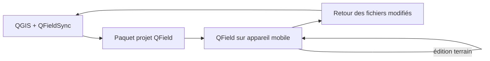

## Objectif

Préparer un projet **Biodiv** pour le travail de terrain avec **QFieldSync**, puis exporter, transférer, utiliser et resynchroniser le projet sur QField.

Ce tutoriel est pensé comme un **exercice complet** : il s'appuie sur un projet QGIS préconfiguré et un GeoPackage déjà prêt à l'emploi.

---

## Ressources fournies

Le dossier ressource dédié se trouve ici :

* [ressources/fichiers/qfield/qfieldsync-biodiv](../ressources/fichiers/qfield/qfieldsync-biodiv)

Il contient :

* `biodiv.gpkg` : la base de données GeoPackage du cas Biodiv ;
* `biodiv_qfieldsync.qgs` : le projet QGIS préconfiguré ;
* `README.md` : le rappel des objectifs et du contenu.

> **Conseil :** ouvrez d'abord le projet fourni, puis enregistrez une copie de travail dans un autre dossier avant de commencer l'exercice.

---

## Architecture de travail QFieldSync

Le scénario QFieldSync repose sur un flux simple :

### Ce que fait QFieldSync

QFieldSync prépare un projet QGIS pour QField en :

* copiant les couches nécessaires dans un paquet dédié ;
* appliquant la stratégie choisie par couche ;
* créant, si besoin, un fond de plan ou une zone de travail ;
* rendant le tout lisible par QField ;
* facilitant la synchronisation du retour vers le bureau.

### Pourquoi cette architecture ?

Elle est particulièrement adaptée lorsque :

* le travail se fait hors ligne ou avec une connexion faible ;
* une équipe souhaite garder un flux simple et maîtrisé ;
* on veut éviter la complexité d’une infrastructure serveur ;
* on travaille sur des campagnes de terrain ponctuelles.

---

## Cas d'étude : Biodiv

* l'ajout de **photos** / pièces jointes rattachées aux observations ;
Le projet Biodiv contient trois couches principales :

* `sites` : zones d'étude ;
* `observations` : relevés terrain ;
* `especes` : table de référence.

Ce projet est intéressant pour QField car il permet de montrer :

* la saisie de nouvelles observations sur le terrain ;
| `photos` | **Offline editing** | table des images liées aux observations |
* la modification d'entités existantes ;
* l'utilisation de relations et de listes de valeurs ;
* le retour des données vers QGIS après la collecte.

---

## Étape 1 : ouvrir le projet préconfiguré

1. Ouvrir QGIS.
2. Charger le fichier [biodiv_qfieldsync.qgs](../ressources/fichiers/qfield/qfieldsync-biodiv/biodiv_qfieldsync.qgs).
3. Vérifier que les couches `sites`, `observations` et `especes` sont bien présentes.
4. Ouvrir la table attributaire de chaque couche pour vérifier les champs.

### Vérifications utiles

* le SCR doit être en **EPSG:2056** ;
* les données doivent pointer vers le GeoPackage local `biodiv.gpkg` ;
* la couche `observations` doit être celle qui sera principalement modifiée sur le terrain.

---

## Étape 2 : configurer les actions QFieldSync par couche

Dans QGIS, ouvrir les propriétés du projet ou utiliser la barre d'outils QFieldSync.

### Recommandation pour le cas Biodiv

| Couche | Action QFieldSync recommandée | Rôle sur le terrain |
|---|---|---|
| `observations` | **Offline editing** | couche principale de saisie terrain |
| `sites` | **Keep existing (copy if missing)** ou **Offline editing** selon le scénario | couche de contexte ou couche à corriger |
| `especes` | **Copy** ou **Keep existing** | table de référence pour les formulaires |

### Interprétation pédagogique

* **Offline editing** : utile pour les couches que l’on veut modifier sur le terrain.
* **Copy** : utile pour les couches de référence à embarquer.
* **Keep existing** : utile si la couche ne change pas souvent et doit être recopiée seulement si nécessaire.

> **Point d'attention :** éviter d'utiliser inutilement plusieurs couches dans un même GeoPackage si cela complique la synchronisation. Pour la formation, garder une structure simple et lisible.
6. vérifier la relation entre `observations` et `photos` ;

---

## Étape 3 : préparer le projet pour le mobile

Avant l'export :

3. prendre une photo et la joindre à une observation via la table `photos` ;
4. vérifier que la valeur par défaut du formulaire s’applique correctement ;
5. contrôler la validation des contraintes de saisie.
4. vérifier les styles de couches ;
5. vérifier les relations entre `observations` et `especes` ;
6. ajouter éventuellement un fond de plan ;
7. choisir une zone de travail si nécessaire.

* les photos sont bien rattachées aux observations ;
### Bonnes pratiques

* privilégier des noms de champs explicites ;
* éviter les géométries trop complexes pour le terrain ;
* s’assurer que les données utiles sont bien embarquées ;
* préparer les valeurs par défaut pour accélérer la saisie.

---

## Étape 4 : exporter le paquet QField

Dans QGIS :

1. ouvrir **QFieldSync** ;
2. choisir **Package for QField** ;
3. sélectionner un dossier de sortie dédié ;
4. valider l'export.

### Résultat attendu

Le dossier exporté contient typiquement :

* le projet QGIS préparé pour QField ;
* les données copiées ou embarquées ;
* les fichiers d'assets nécessaires ;
* le fond de plan si vous en avez défini un ;
* les chemins adaptés au fonctionnement mobile.

### Ce qu’il faut contrôler juste après l’export

* le projet s’ouvre bien depuis le dossier exporté ;
* les couches sont visibles ;
* les formulaires fonctionnent ;
* les liens vers les pièces jointes sont valides ;
* les couches éditables sont bien marquées comme telles.

---

## Étape 5 : transférer le paquet vers l’appareil mobile

Selon votre contexte, le transfert peut se faire :

* par câble USB ;
* par dossier synchronisé ;
* par cloud de fichiers ;
* par copie manuelle sur le stockage de l'appareil.

### Organisation recommandée

Créer un dossier de travail explicite, par exemple :

* `Biodiv_QField_2026`
* `Biodiv_Terrain_Campagne_01`

Le nom doit aider à identifier facilement la campagne et éviter les confusions entre plusieurs versions.

---

## Étape 6 : travailler dans QField

Une fois le projet ouvert dans QField, l’utilisateur peut :

* consulter la carte ;
* se localiser ;
* ajouter de nouvelles observations ;
* modifier certains attributs ;
* prendre une photo ou joindre un média ;
* corriger une géométrie si la couche est éditable.

### Exercice terrain proposé

1. ajouter **3 nouvelles observations** d'espèces différentes ;
2. modifier le champ `nb_individus` sur au moins une observation ;
3. prendre une photo et la joindre à une observation ;
4. vérifier que la valeur par défaut du formulaire s’applique correctement ;
5. contrôler la validation des contraintes de saisie.

---

## Étape 7 : synchroniser le retour vers QGIS

Après le terrain, revenir sur le poste bureau et :

1. recopier le paquet modifié ;
2. rouvrir le projet dans QGIS ;
3. lancer **Synchronize from QField** ;
4. vérifier que les changements ont été intégrés.

### Points à vérifier après synchronisation

* les nouvelles observations sont bien visibles ;
* les attributs saisis sur le terrain sont corrects ;
* les pièces jointes sont présentes ;
* les géométries sont bien mises à jour ;
* aucune donnée n'a été écrasée par erreur.

> **Attention :** avec cette architecture, il faut synchroniser de manière disciplinée. Si l’on repart en terrain avec un paquet déjà modifié sans repartir d’une base propre, on augmente les risques de doublons ou d’écrasement.

---

## Exercice complet proposé

### Partie A : préparation

1. ouvrir le projet Biodiv fourni ;
2. repérer les trois couches ;
3. vérifier les champs utiles au levé ;
4. configurer les actions QFieldSync par couche.

### Partie B : export

1. exporter le paquet QField ;
2. vérifier que les fichiers attendus sont présents ;
3. ouvrir le paquet exporté pour contrôle.

### Partie C : terrain simulé

1. simuler la saisie de plusieurs observations ;
2. simuler une correction d’attribut ;
3. simuler l’ajout d’une pièce jointe.

### Partie D : retour bureau

1. rapatrier le paquet modifié ;
2. synchroniser les données dans QGIS ;
3. contrôler le résultat dans la table attributaire ;
4. afficher la couche sur la carte.

---

## Ce que l'apprenant doit retenir

* QFieldSync sert à **préparer** un projet QGIS pour QField.
* Le flux est basé sur un **paquet de travail** à transférer sur le terrain.
* La structure des couches doit être pensée en fonction du mode de synchronisation.
* Le cas Biodiv est idéal pour montrer un flux simple, clair et reproductible.

---

## Et après ?

Une fois ce flux maîtrisé, on peut passer à :

* l’intégration de **QFieldCloud** ;
* la gestion de projets multi-utilisateurs ;
* l’usage d’une base centrale PostgreSQL/PostGIS ;
* la préparation de formulaires plus avancés.

## Documentation spécifique

* [QFieldSync - Cable packaging](https://docs.qfield.org/get-started/tutorials/get-started-qfs/)
* [Gestion du stockage dans QField](https://docs.qfield.org/how-to/project-setup/storage/)
* [QFieldCloud - prise en main](https://docs.qfield.org/get-started/tutorials/get-started-qfc/)
* [Références de QField](https://docs.qfield.org/reference/)
